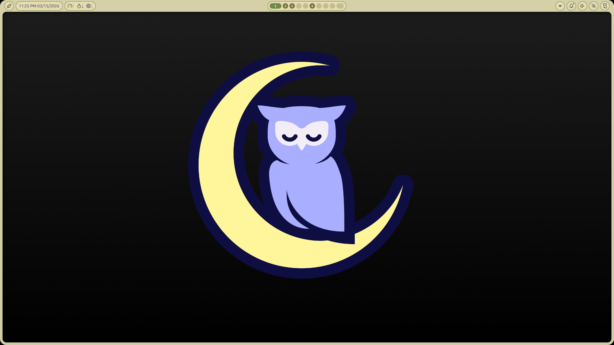
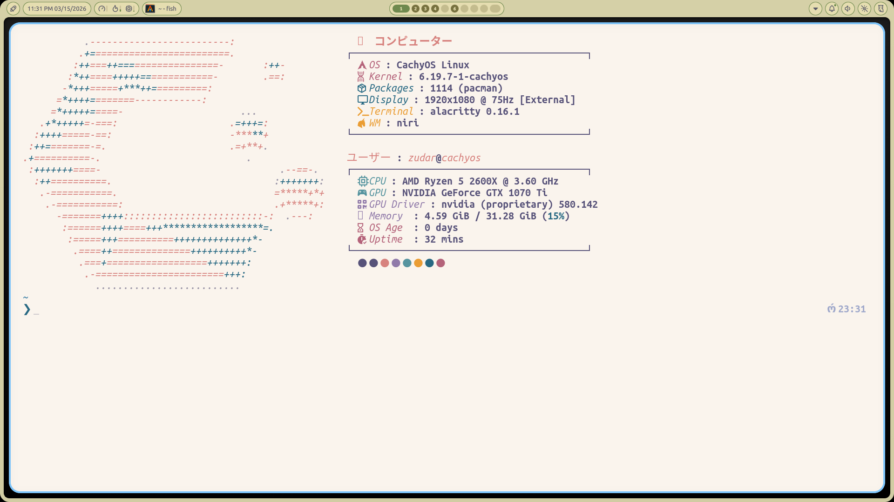
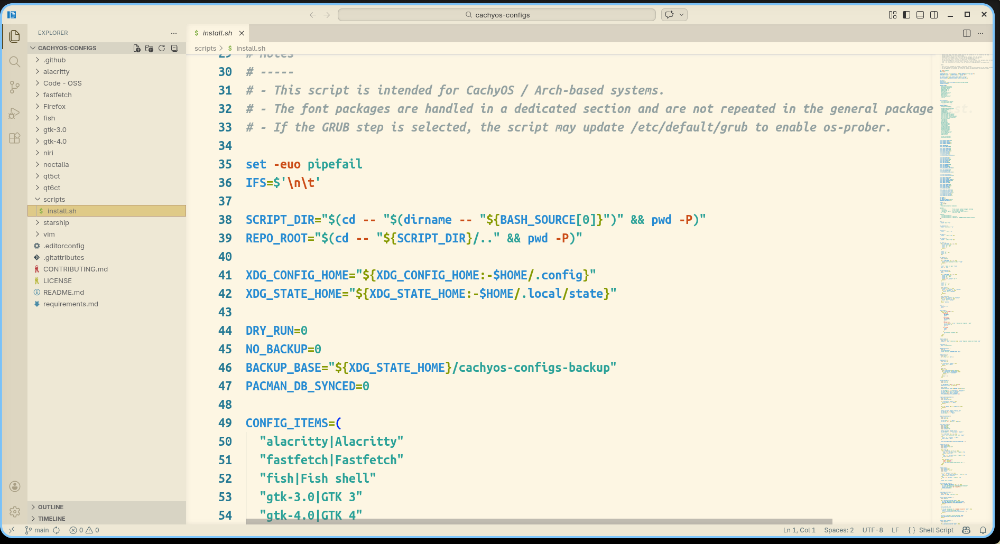

# cachyos-configs

[](https://github.com/zudaR107/cachyos-configs/actions/workflows/lint.yml)
[](LICENSE)

A minimal, portable, public-friendly set of **CachyOS** desktop configuration files.

This repository is a curated snapshot of a real daily-driver setup built around **Niri**, **Noctalia**, **Fish**, **Alacritty**, **Starship**, **GTK/Qt theming**, **Firefox**, **Code - OSS**, and a small **Vim** setup. It intentionally tracks only the configuration files that are stable, understandable, and worth keeping under version control.

> License: **AGPL-v3.0**

---

## Screenshots

### Desktop overview



### Alacritty + Fastfetch



### Code - OSS



---

## Repository Layout

```text
.
├── .github/            # Issue templates, PR template, CI workflow
├── Code - OSS/         # Code - OSS settings and extension list
├── Firefox/            # Firefox user.js and extension list
├── alacritty/          # Alacritty terminal config
├── assets/             # Screenshots used by the repository
├── fastfetch/          # Fastfetch output layout
├── fish/               # Fish config and helper functions
├── gtk-3.0/            # GTK 3 appearance settings
├── gtk-4.0/            # GTK 4 appearance settings
├── niri/               # Niri config split into topic-based includes
├── noctalia/           # Noctalia colors and settings
├── qt5ct/              # Qt5ct appearance config
├── qt6ct/              # Qt6ct appearance config
├── scripts/            # Interactive bootstrap script
├── starship/           # Starship prompt config
├── vim/                # Vim entrypoint, HyDE defaults, colorscheme
├── .editorconfig       # Editor formatting rules
├── .gitattributes      # Line ending normalization
├── .gitignore          # Local junk / temporary files to ignore
├── CONTRIBUTING.md     # Contribution guidelines
├── LICENSE             # AGPL-v3.0 license text
├── README.md           # Project overview and usage guide
└── requirements.md     # Expected dependencies and runtime assumptions
```

---

## What This Repository Is

This repo tracks config files that are:

* **Portable** — safe to publish and reuse
* **Curated** — intentionally selected instead of dumping an entire `~/.config`
* **Stable enough to version** — not high-churn machine state
* **Documented** — comments are written to explain intent, not just syntax

This is **not** meant to be a full system backup.

---

## What Is Included

### Desktop and shell

* **Niri**: keybinds, layout, input, environment and misc behavior
* **Noctalia**: shell colors and settings used by the desktop shell
* **Fish**: main shell config, helper functions, aliases, abbreviations, XDG-related setup
* **Starship**: prompt configuration
* **Fastfetch**: custom system summary layout
* **Alacritty**: fonts, colors, window settings, scrolling, key bindings

### Appearance

* **GTK 3 / GTK 4**: theme, icon, cursor and font settings
* **qt5ct / qt6ct**: Qt appearance and interface settings

### Applications

* **Code - OSS**:

  * `settings.jsonc` stored in the repo as a documented source file
  * `extensions.txt` as a reference/install list
* **Firefox**:

  * `user.js` with portable preferences
  * `extensions.txt` as a reference list
* **Vim**:

  * `vimrc` as the user entrypoint
  * `hyde.vim` for HyDE-oriented defaults
  * custom `wallbash.vim` colorscheme file

### Repository support files

* **Bootstrap script** for interactive setup tasks
* **CI lint workflow** for syntax and hygiene checks
* **Issue / PR templates** for cleaner collaboration

---

## What Is Not Included

By design, this repository avoids tracking:

* secrets or sensitive data
* cookies, tokens, sync state, private credentials
* cache and runtime state
* MRU lists and recent-file history
* machine-specific identifiers when they are not useful
* large generated files or vendor bundles
* config noise that changes constantly and has little long-term value

If a file is mostly GUI-generated but still stable, useful, and reviewable, it can still belong here.

---

## Requirements

This setup assumes a **CachyOS / Arch-like** environment and a Wayland desktop based on **Niri**.

See [`requirements.md`](requirements.md) for the full list of:

* required applications
* helper CLI tools
* fonts
* themes / icons / cursor theme
* Wayland / Qt expectations

---

## Installation

There are three reasonable ways to use this repository.

### 1. Clone the repository

```bash
git clone https://github.com/zudaR107/cachyos-configs.git
cd cachyos-configs
```

### 2. Use the bootstrap script

The repository includes an interactive bootstrap script:

```bash
bash scripts/bootstrap.sh
```

What it can do:

* optionally install fonts and packages
* optionally generate SSH and GPG keys
* optionally configure global Git identity and signing
* optionally scan for other OSes and rebuild GRUB config
* optionally copy selected config directories into `~/.config`
* optionally install Code - OSS settings and extensions

Useful modes:

```bash
bash scripts/bootstrap.sh --dry-run
bash scripts/bootstrap.sh --no-backup
```

> The bootstrap script is intentionally interactive. Read it before running it.

### 3. Symlink configs manually

This is the cleanest option if you want to keep the repository as the source of truth.

```bash
ln -sfn "$PWD/alacritty" "$HOME/.config/alacritty"
ln -sfn "$PWD/fastfetch" "$HOME/.config/fastfetch"
ln -sfn "$PWD/fish" "$HOME/.config/fish"
ln -sfn "$PWD/gtk-3.0" "$HOME/.config/gtk-3.0"
ln -sfn "$PWD/gtk-4.0" "$HOME/.config/gtk-4.0"
ln -sfn "$PWD/niri" "$HOME/.config/niri"
ln -sfn "$PWD/noctalia" "$HOME/.config/noctalia"
ln -sfn "$PWD/qt5ct" "$HOME/.config/qt5ct"
ln -sfn "$PWD/qt6ct" "$HOME/.config/qt6ct"
ln -sfn "$PWD/starship" "$HOME/.config/starship"
ln -sfn "$PWD/vim" "$HOME/.config/vim"
```

### 4. Copy selected directories manually

```bash
cp -a alacritty "$HOME/.config/"
cp -a fastfetch "$HOME/.config/"
cp -a fish "$HOME/.config/"
cp -a gtk-3.0 "$HOME/.config/"
cp -a gtk-4.0 "$HOME/.config/"
cp -a niri "$HOME/.config/"
cp -a noctalia "$HOME/.config/"
cp -a qt5ct "$HOME/.config/"
cp -a qt6ct "$HOME/.config/"
cp -a starship "$HOME/.config/"
cp -a vim "$HOME/.config/"
```

> Back up existing configs first if you already use these tools.

---

## Notes by Component

### Alacritty

* File: `alacritty/alacritty.toml`
* Includes colors, fonts, padding, scrollback settings and custom key bindings

### Code - OSS

* Files: `Code - OSS/settings.jsonc`, `Code - OSS/extensions.txt`
* The repository stores settings as `settings.jsonc` so the file can stay documented with comments
* If you install it into Code - OSS, it should normally end up as `settings.json`

Install extensions from the list:

```bash
while read -r ext; do
  [[ -z "$ext" || "$ext" =~ ^# ]] && continue
  code --install-extension "$ext"
done < "Code - OSS/extensions.txt"
```

> Depending on your package, the executable may be `code-oss` instead of `code`.

### Firefox

* Files: `Firefox/user.js`, `Firefox/extensions.txt`
* `user.js` must be copied into the active Firefox profile directory, next to `prefs.js`

### Fish

* Main file: `fish/config.fish`
* Helper functions live in `fish/functions/`
* Some helpers expect tools such as `eza`, `fzf`, `bat`, `yazi`, and `duf`

### Niri

* Main entrypoint: `niri/config.kdl`
* Topic-based includes live under `niri/cfg/`

### Noctalia

* Files: `noctalia/colors.json`, `noctalia/plugins.json`, `noctalia/settings.json`
* Stores shell palette, plugin source list, and shell behavior/settings

### Vim

* `vim/vimrc` is the entrypoint
* `vim/hyde.vim` contains the HyDE-oriented defaults
* `vim/colors/wallbash.vim` provides the custom colorscheme file included in this repo

---

## Linting and Repository Hygiene

The repository includes a GitHub Actions workflow that checks:

* JSON, JSONC and TOML validity
* GitHub Actions workflow syntax via `actionlint`
* YAML formatting via `yamllint`
* Fish syntax
* shell scripts via `shellcheck` and `bash -n`
* whitespace, line endings and final newline hygiene

The goal is to keep the repository clean, reviewable, and safe to publish.

---

## Contributing

Contributions are welcome, but keep them:

* portable
* documented
* minimal
* free from secrets and machine-specific junk

Please read [`CONTRIBUTING.md`](CONTRIBUTING.md) before opening a pull request.

---

## License

This project is licensed under the **GNU Affero General Public License v3.0**.

See [`LICENSE`](LICENSE) for the full text.

---

## Contact

For public discussion, prefer GitHub issues.

For direct contact:

* [cuso4ek55@gmail.com](mailto:cuso4ek55@gmail.com)
* [zudin_daniil@mail.ru](mailto:zudin_daniil@mail.ru)
